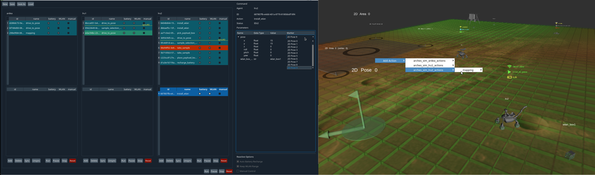

# ROSMC

ROS Mission Control (ROSMC) is a high-level mission designing and monitoring tool for a team of multiple heterogeneous robots.
ROSMC is build upon ROS and utilizes Rviz plugins and Rqt plugins to provide intuitive graphical user interfaces (GUIs).

ROSMC is currently supported with ROS Melodic.

The command GUI (left) is the main interface to build and monitor the entire mission, being implemented as an Rqt plugin.
The 3D GUI (right), an Rviz instance empowered by custom Rviz plugins, enables intuitive task parametrization as well as increases situational awareness.

A central server (called the mission server) runs separately from these GUIs so that the mission data is persistently maintained.
The server sends/receives missions to/from a specific RAFCON statemachine named 'mission executor', which is run on each robot.

## Dependencies
- [QDarkStyleSheet](https://github.com/ColinDuquesnoy/QDarkStyleSheet.git)
  - `pip2 install qdarkstyle --user`

## Related repositories
### Core components
- [rosmc_interface_msgs](https://github.com/DLR-RM/rosmc_interface_msgs.git) defines interface msgs and srvs with the 'mission executor', which interfaces with ROSMC with service calls and manage the actual execution of robotic skills
- [mission_control_rafcon_statemachines](https://github.com/DLR-RM/mission_control_rafcon_statemachines.git) provides the 'mission executor' and the instruction on how to include robot-specific high-level skills using [RAFCON](https://github.com/DLR-RM/rafcon.git)
### Example with turtlesim
- [rosmc_turtlesim_statemachines](https://github.com/DLR-RM/rosmc_turtlesim_statemachines.git) provides an example of integration of the 'mission executor' with turtlesim

## Demo
Using all the repos above, let's start a demo with turtlesim.
### Preparation
- Clone rosmc and rosmc_interface_msgs into your catkin workspace and build them
- Clone rosmc_turtlesim_statemachines: `git clone --recurse-submodules https://github.com/DLR-RM/rosmc_turtlesim_statemachines.git ~/rosmc_turtlesim_statemachines`
- Install [RAFCON](https://github.com/DLR-RM/rafcon.git): `pip install rafcon --user`
### Processes
- Roscore: `roscore`
- ROSMC Backend:
  - Mission server: `ROSMC_TURTLESIM_STATEMACHINES=$HOME/rosmc_turtlesim_statemachines roslaunch rosmc_mission_server turtlesim_mission_server.launch`
  - Task marker servers: `roslaunch rosmc_task_marker_server all_task_marker_server.launch`
  - Agent marker server: `ROS_NAMESPACE=mission_control rosrun rosmc_agents turtles_int_marker_publisher.py`
- Turtlesim: 
  - Simulator node: `rosrun turtlesim turtlesim_node`
  - Spawn turtle2: `rosservice call /spawn 2.0 6.0 3.14 'turtle2'`
  - TF publisher for turtle1: `roslaunch rosmc_agents turtle1_tf_broadcaster.launch`
  - TF publisher for turtle2: `roslaunch rosmc_agents turtle2_tf_broadcaster.launch`
  - Status publisher: `rosrun rosmc_agents turtles_status_publisher.py`
- ROSMC Frontend:
  - Command GUI: `ROS_NAMESPACE=mission_control rosrun rosmc_command_gui rosmc_command_gui register_to_mission_server:=/mission_control/register_to_mission_server`
  - Rviz: `roslaunch rosmc_3d_gui 3d_gui.launch` 
  - Status icons: `ROS_NAMESPACE=mission_control rosrun rosmc_status_monitor status_icons_publisher.py _frame_id_suffix:=""`
- RAFCON:
  - For turtle1: `SM_DIR=~/rosmc_turtlesim_statemachines; ROS_IP=127.0.0.1 ROS_MASTER_URI=http://localhost:11311/ ROS_NAMESPACE=turtle1 rafcon -c $SM_DIR/config.yaml -o $SM_DIR/modules/mission_control/mission_executor/mission_executor` and start statemachine
  - For turtle2: `SM_DIR=~/rosmc_turtlesim_statemachines; ROS_IP=127.0.0.1 ROS_MASTER_URI=http://localhost:11311/ ROS_NAMESPACE=turtle2 rafcon -c $SM_DIR/config.yaml -o $SM_DIR/modules/mission_control/mission_executor/mission_executor` and start statemachine
- In the Command GUI, from the top menu bar, click "load" and choose [turtle_mission/demo](turtle_mission/demo), click "sync" on the bottom, and then click "run"

### Create, run, and monitor mission
See [howto.md#step-4-create--execute-mission](howto.md#step-4-create--execute-mission)

## Use ROSMC with your robots
See [howto.md](howto.md)

